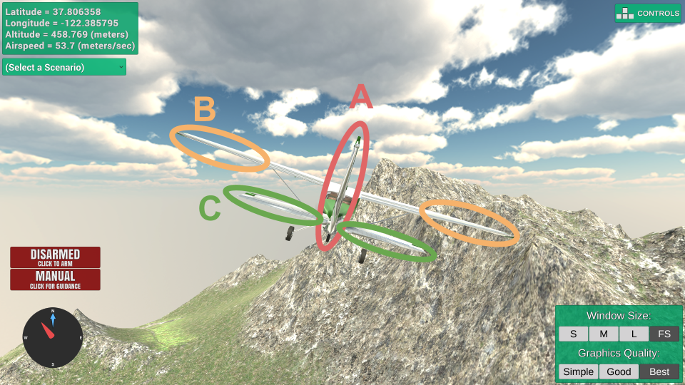
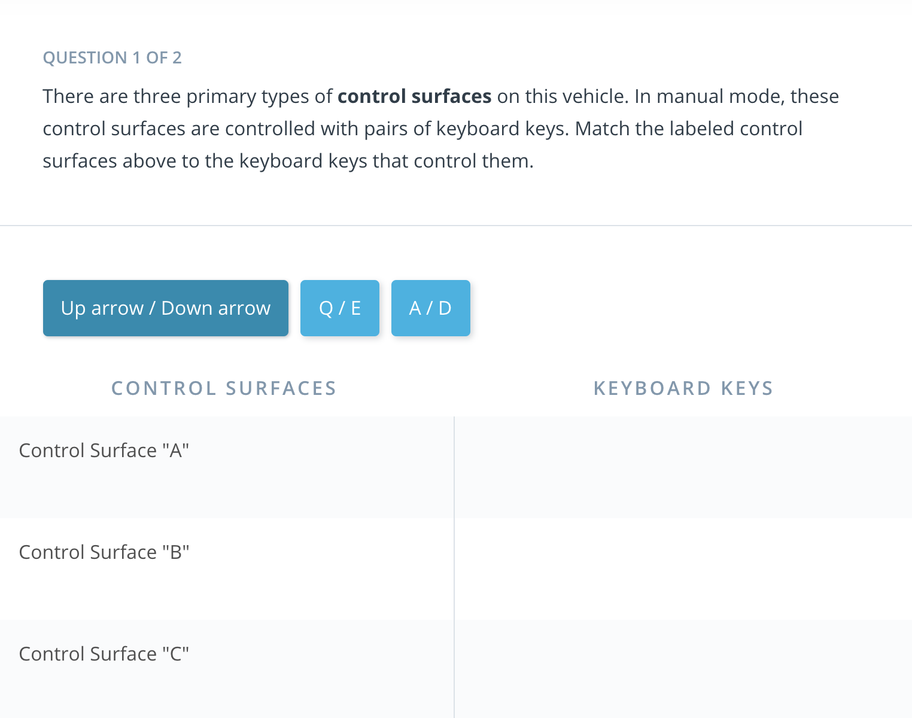
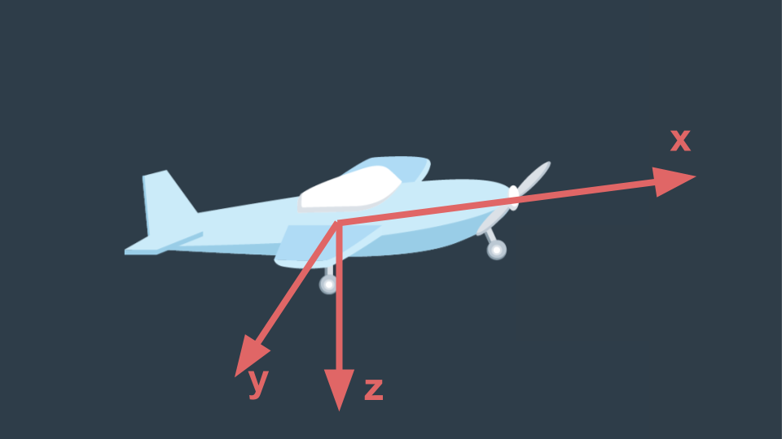
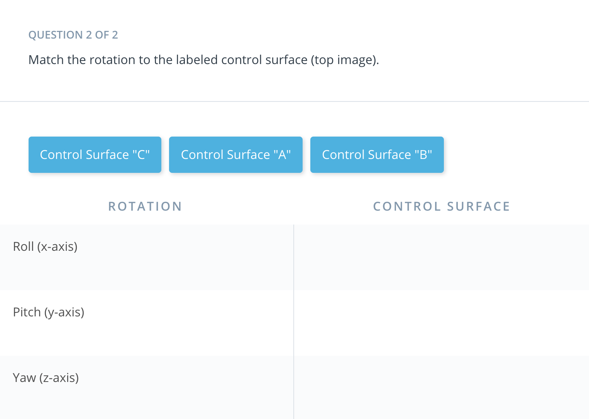

# 1. Introduction to Fixed Wing Flight

## 6. Installing 

Fixed Wing Simulator
The (optional) final project for this course involves writing a controller for a fixed wing aircraft. You don't need to worry about the details of this project right now, but now would be a good time to install the fixed wing simulator you'll be using.

At this point you should:
1. Visit the [github repository](https://github.com/udacity/FCND-FixedWing) for the final project and skim through the instructions so you have a sense for what the final project is.
2. Download the [appropriate fixed wing simulator](https://github.com/udacity/FCND-FixedWing/releases) for your machine.
3. Play around in sandbox mode (there are instructions in the final project repo page for how to do this)
4. Answer the questions below about the control surfaces on a fixed wing vehicle.

The body frame axes for a fixed wing vehicle are typically defined as shown above. Rotations about each of these axes is given its own name.

Roll is rotation about the x axis
Pitch is rotation about the y axis
Yaw is rotation about the z axis
Each of the three control surfaces is primarily responsible for rotations about one of these axes.

