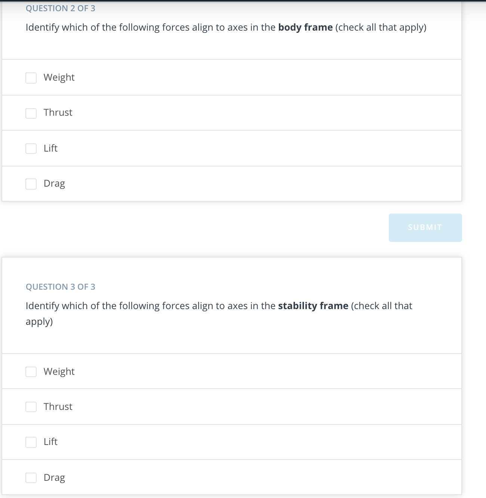

# 2. Lift and Drag

## [1.Introduction](https://youtu.be/KYbi95VDT1s)

## 2. Physics Review

In flight, a fixed wing aircraft experiences four forces:

1. **Weight (W)**
2. **Thrust (T)**
3. **Lift (L)**
4. **Drag (D)**

Answer: L = 7500N

Since this plane is in equilibrium, the vertical forces and horizontal forces must sum to zero. That means the downwards weight force must be exactly balanced by the upwards lift force.

Answer: a_x approx = 2 m/s^2

## [3. Fixed Wing Dynamics: Longitudinal vs Lateral/Directional](https://youtu.be/k_sNlUyeNS0)

## [4. Longitudinal Analysis](https://www.youtube.com/watch?v=Y2qxWFaWwt0&feature=emb_logo)

## [5. Longitudinal Analysis  P2](https://youtu.be/JU5iSi-RoAE)

## 6. Frames of Reference Summary

## 7. Rotation Matrices Exercise

## [8. Lift + Stall](https://youtu.be/8iVgnZ0hrW4)

## [9. Calculating Lift](https://youtu.be/I94_czCrWn0)

## [10. Drag](https://youtu.be/WJp3-vrVVcM)

## 11. Pitching

## [12. Trim States And Simplified Models](https://youtu.be/ANXsAZ6ZuoI)

## 13. Straight + Level Flight

## 14. Climbing Flight

## 15. Fixed Wing [Cheat Sheet](https://www.overleaf.com/project/5c38c45c44913a4f54d89e3f)

## 16. Lift + Drag Exercise

## [17. Conclusion](https://youtu.be/DR7ObN2rBRs)
