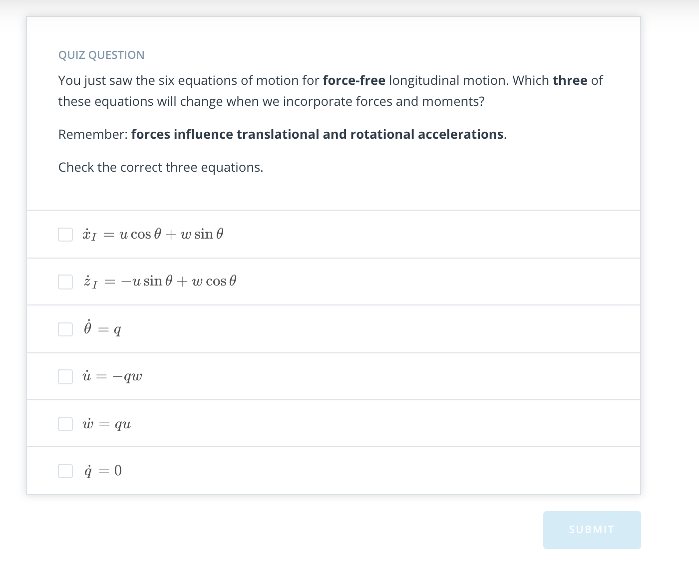
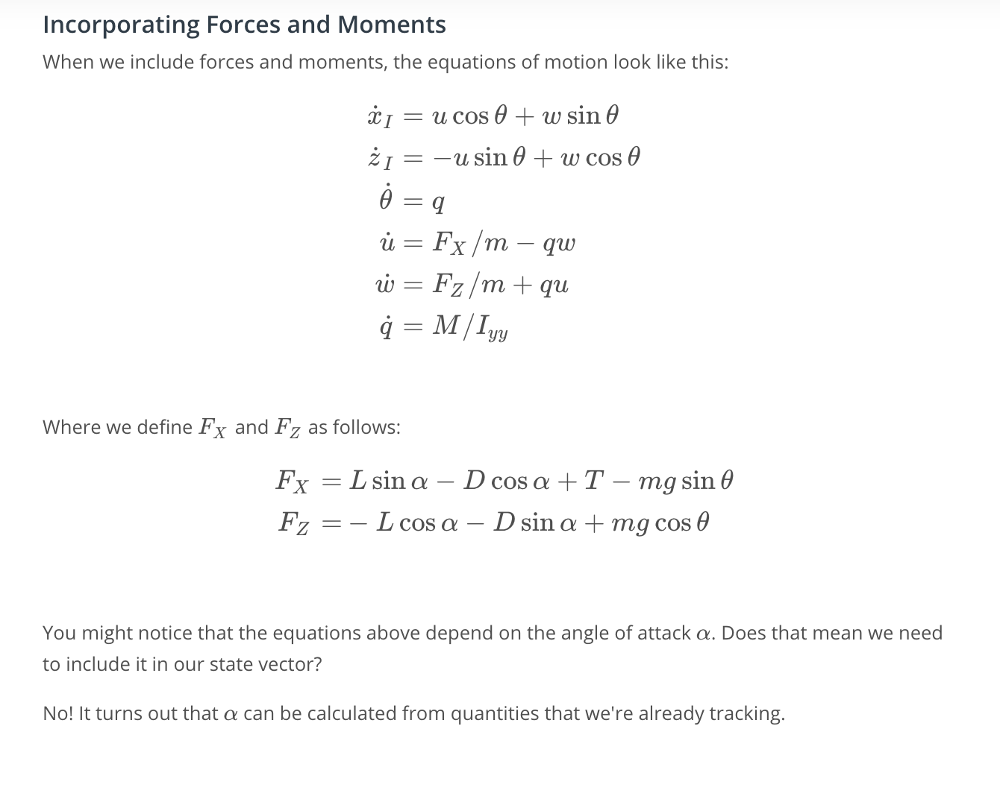
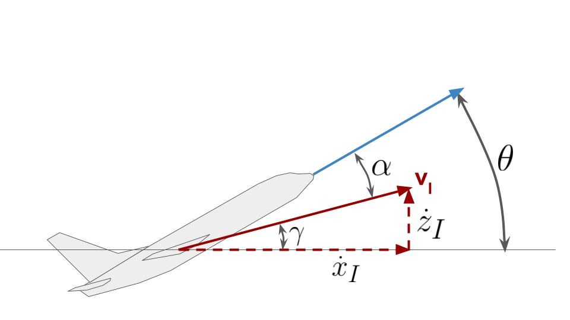
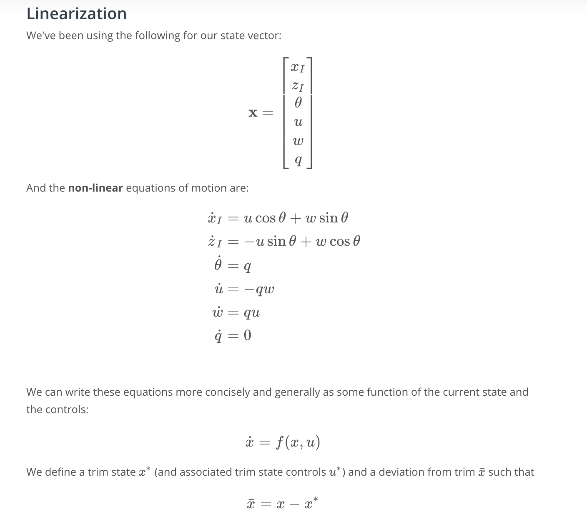
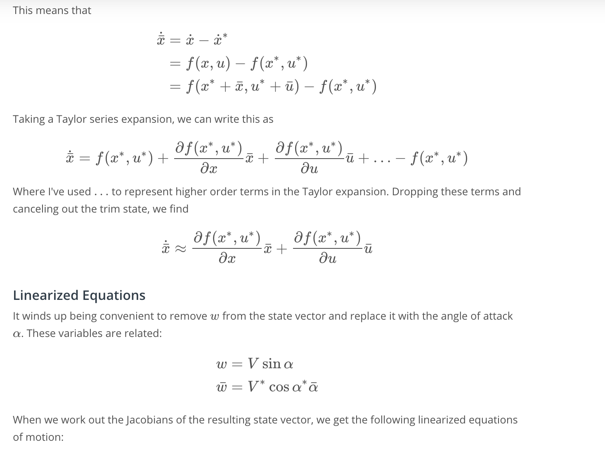
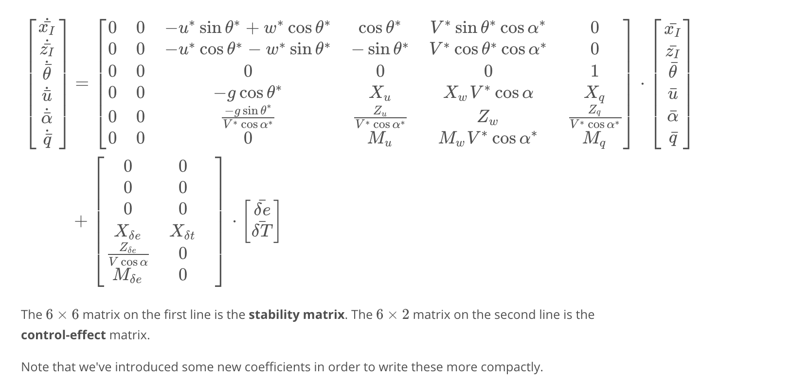
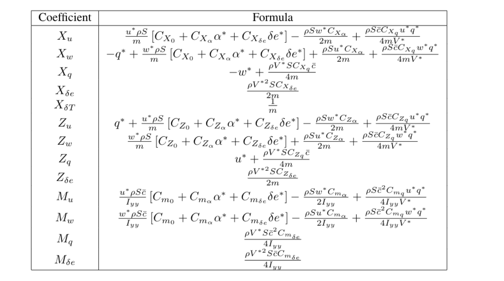
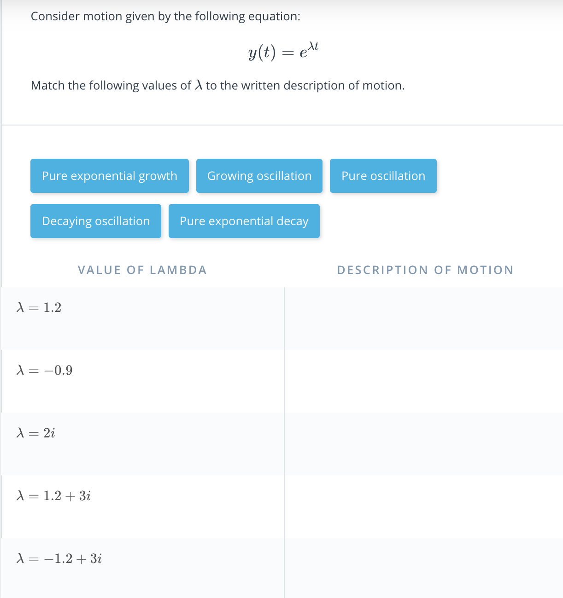
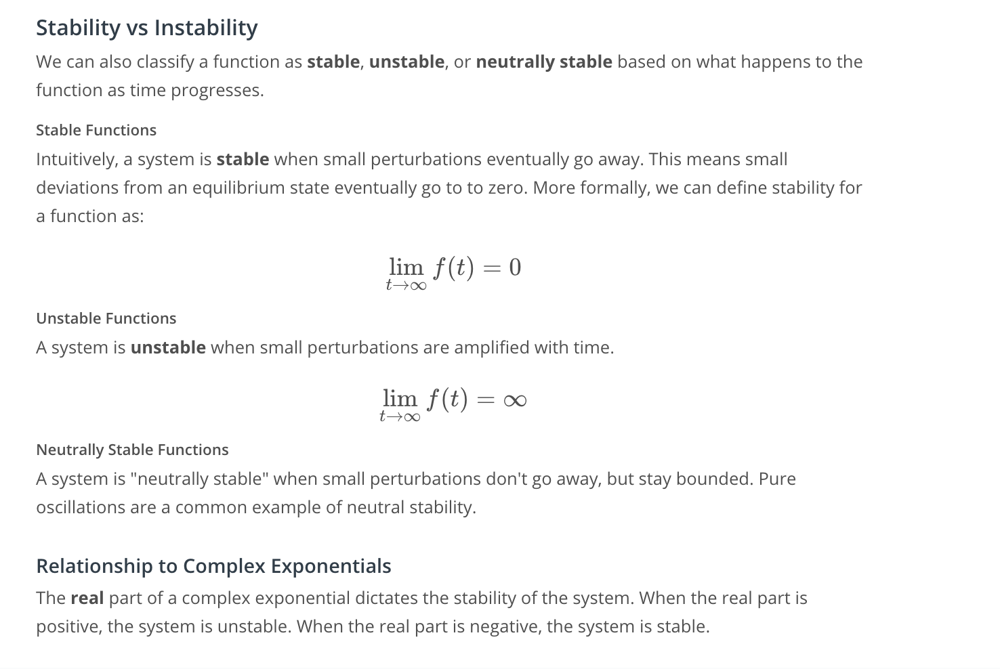

# 3. Longitudinal Model

## [1.Introduction](https://youtu.be/1-iv2ZHEGDg)

## [2. Force Free Motion](https://youtu.be/UBWxJ6Cub6U)

## 3. Characterizing State Variables

## [4. Full Longitudinal Dynamics](https://youtu.be/FZMja7L7hn4)

## 5. Exploring Longitudinal Dynamics Exercise

## [6. Understanding Oscillations](https://youtu.be/GYaU98xGq5w)
## [7. The Rest of the Lesson](https://youtu.be/IAlM_7JrOBY)
## [8. Linearized Model](https://youtu.be/OHJL7tIpKEw)

## [9. Eigenvalues and Eigenvectors](https://youtu.be/ZehfPpMlyUc)

## 10. Exploring Complex Exponentials Notebook

## 11. Exponentials and Stability

## [12. Modes of Motion](https://youtu.be/wsTmXnLt_Fs)
## 13. Identifying Eigenvalues Exercise

## [14. Short Period Response and Phugoid](https://youtu.be/yJ6XJNYhHWw)
## [15. Conclusion](https://youtu.be/8kQI5lI_aIo)

