# 4. Lateral-Directional Model

## [1.Introduction](https://youtu.be/vlvIUyhyvE4)

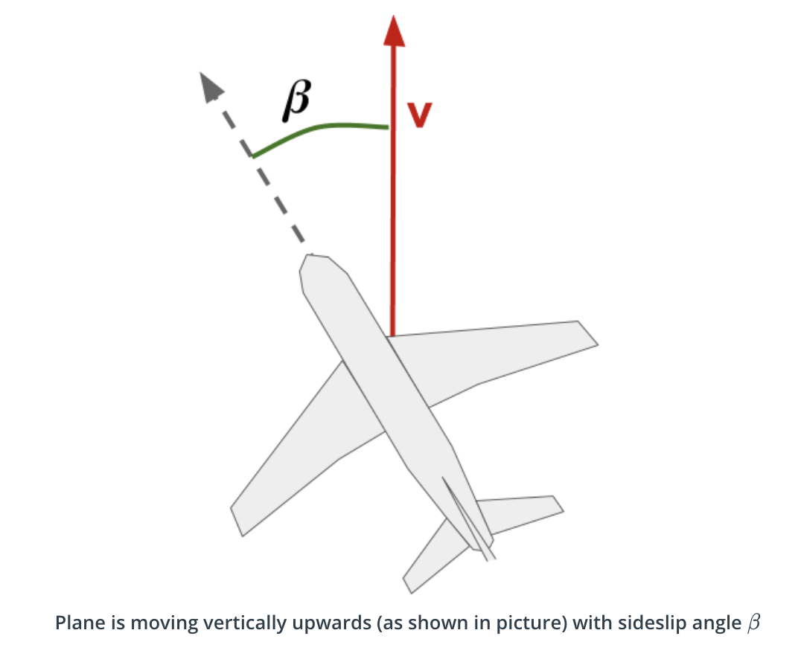

## 2. Force Free Motion

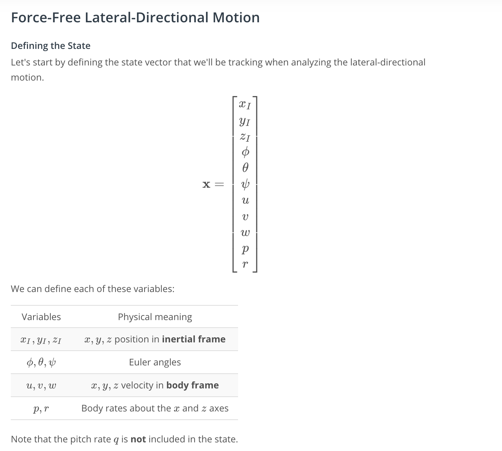
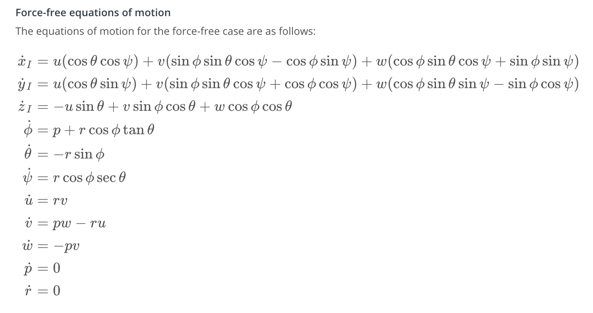
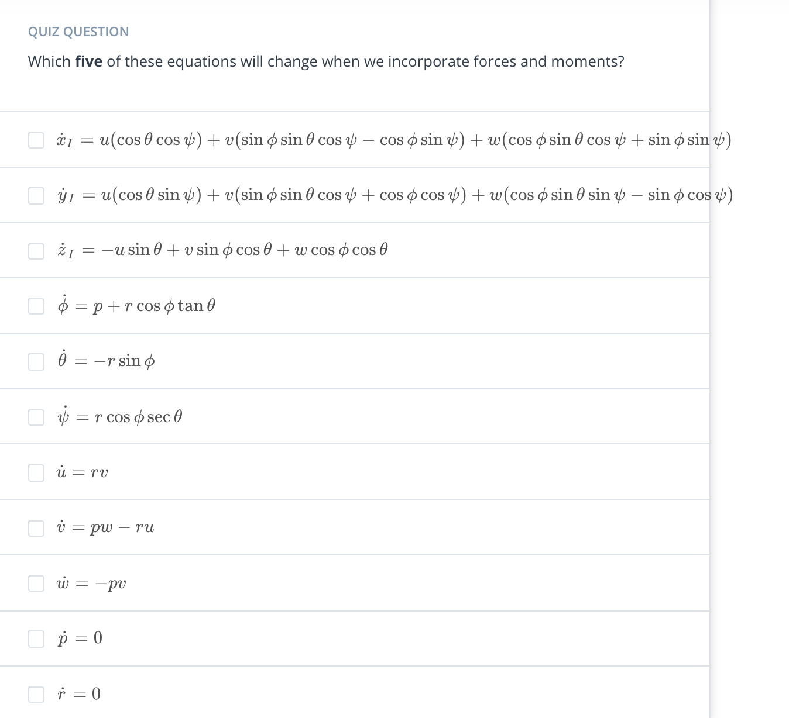

## [3. Incorporating Forces](https://youtu.be/oZjryB3BpGY)

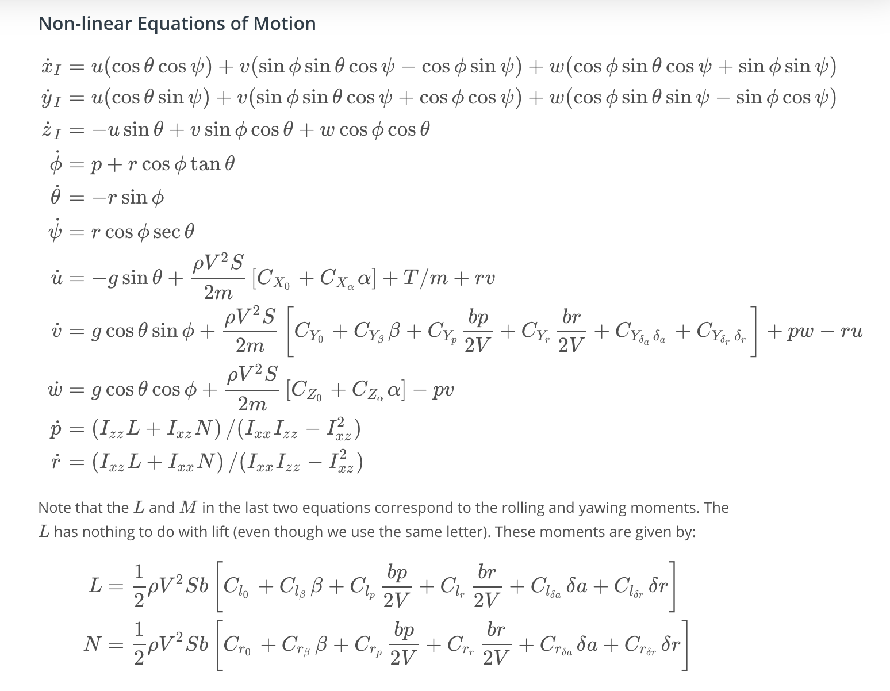

## [4. Coordinated Turns](https://youtu.be/hQYoItsBUeQ)

## 5. Roll Yaw Coupling

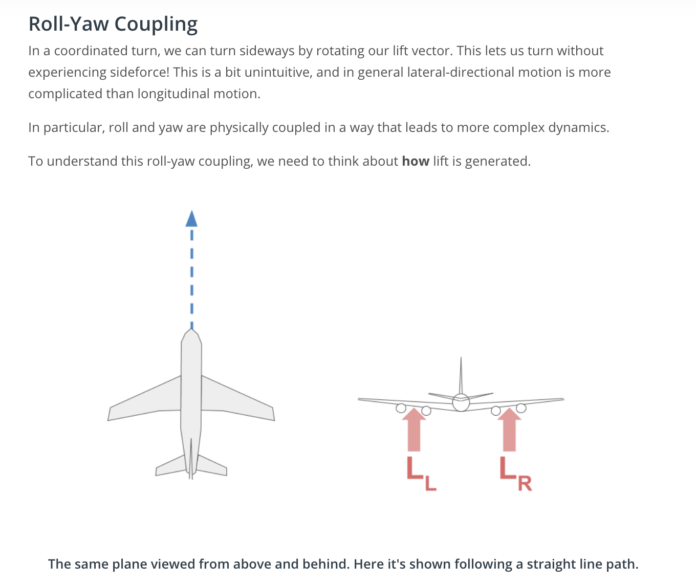
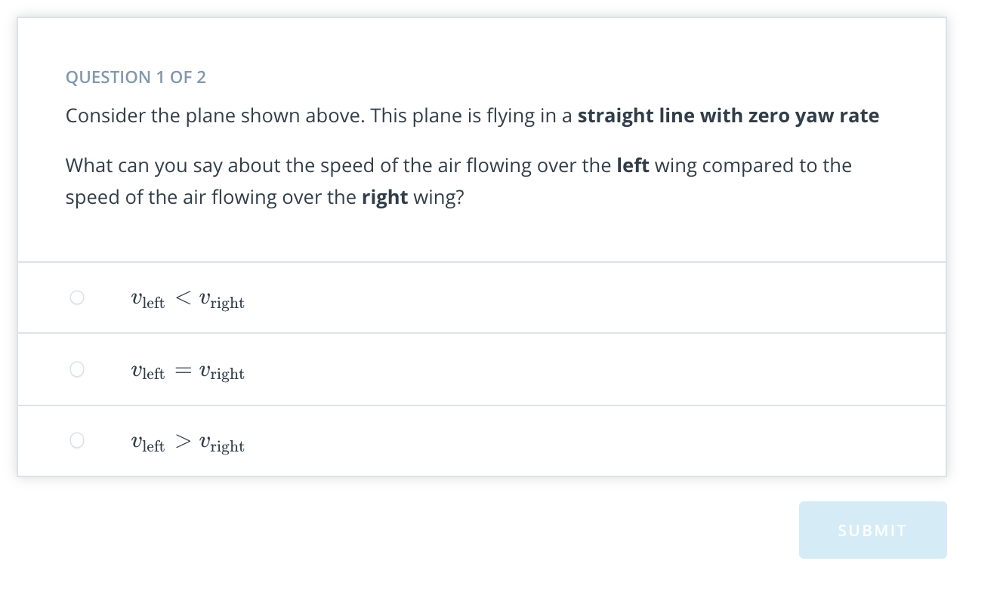
answer: vleft = vright
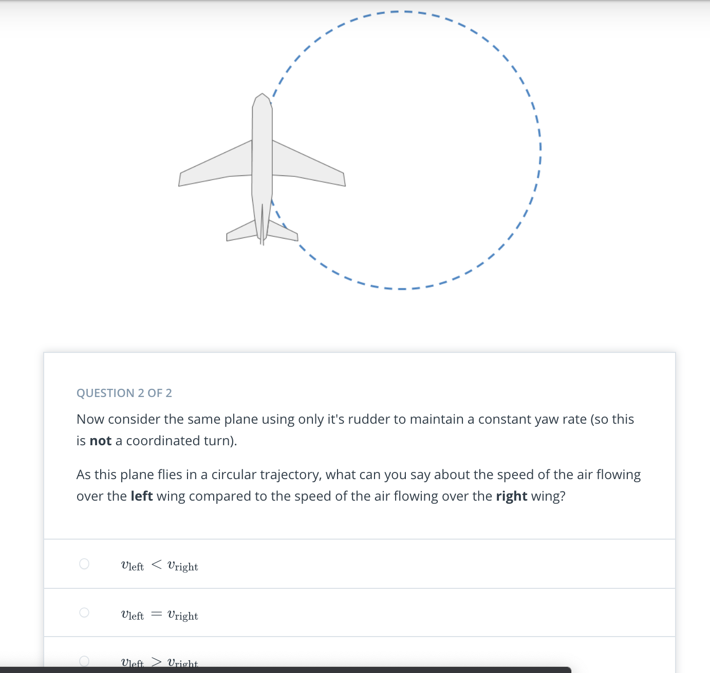
answer: vleft > vright
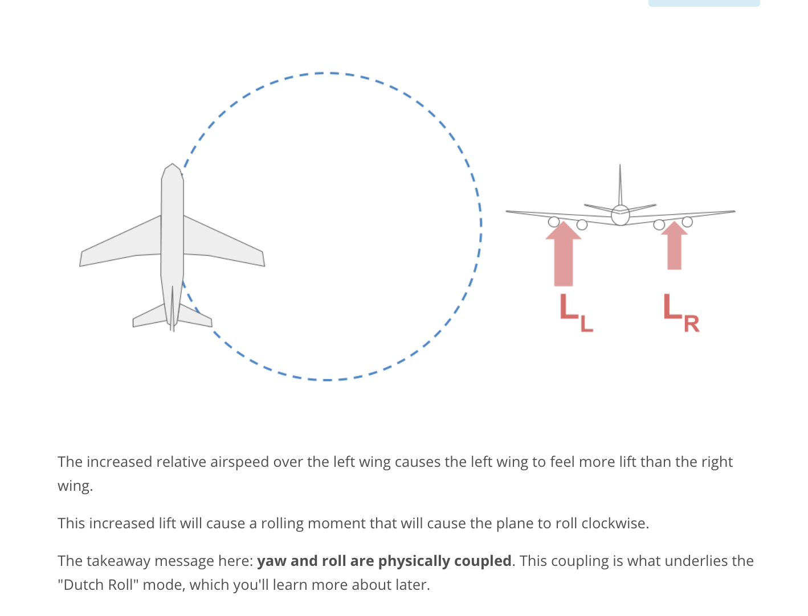

## [6. Static Stability](https://youtu.be/Bmg66oeHXG0)

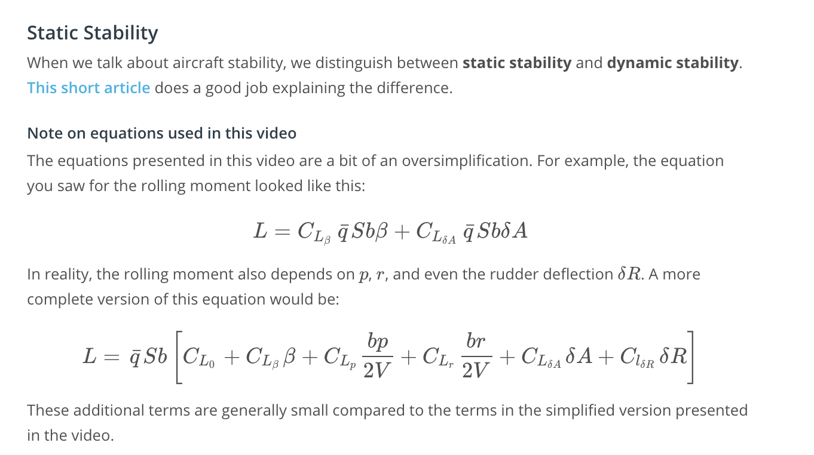

## [7. The Rest of the Lesson](https://youtu.be/C5wdgT7aOTE)
## 8. Linearized Model

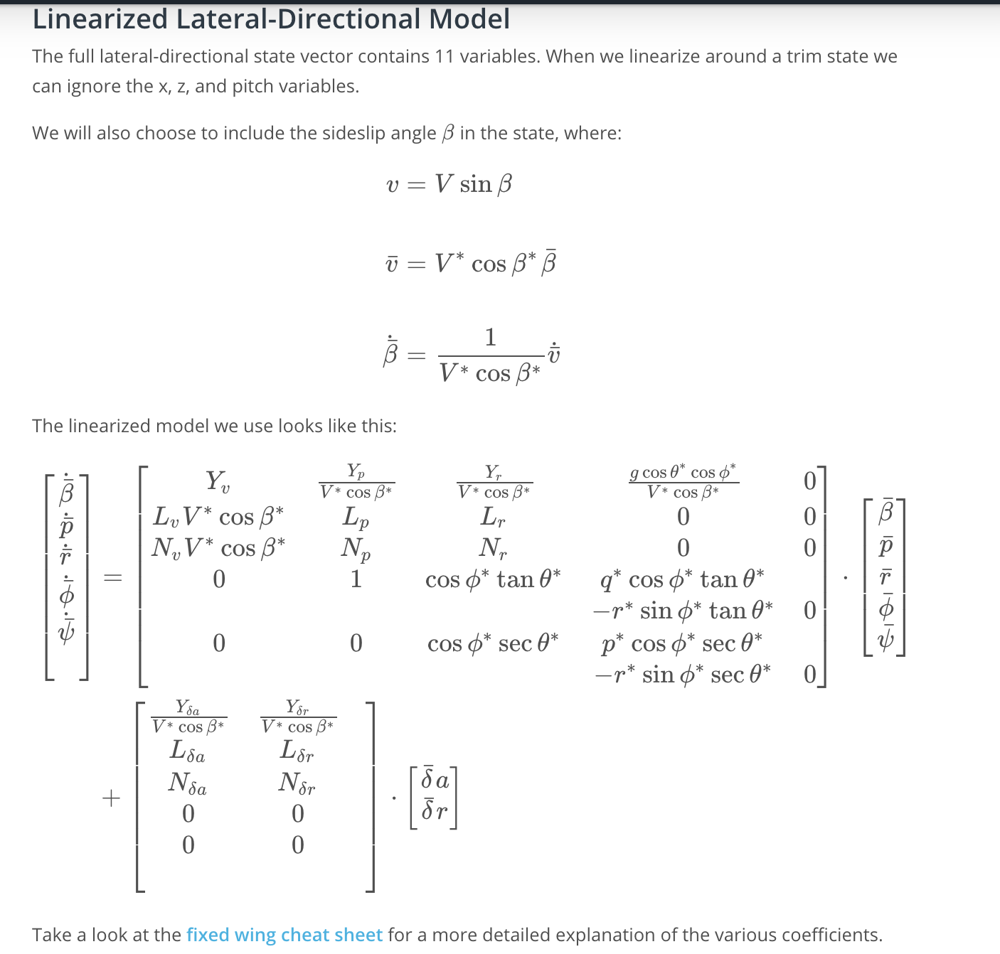

## 9. Identifying Dynamic Modes

## [10. Stability Analysis 1: Roll Mode](https://youtu.be/dohXBQOl8QM)
## [11. Stability Analysis 2: Spiral Mode](https://youtu.be/GtCNe6gBi10)
## [12. Stability Analysis 3: Dutch Roll](https://youtu.be/OFhzQSTRGwQ)
## [13. Conclusion](https://www.youtube.com/watch?v=C-K_pshzDuY&feature=emb_logo)

