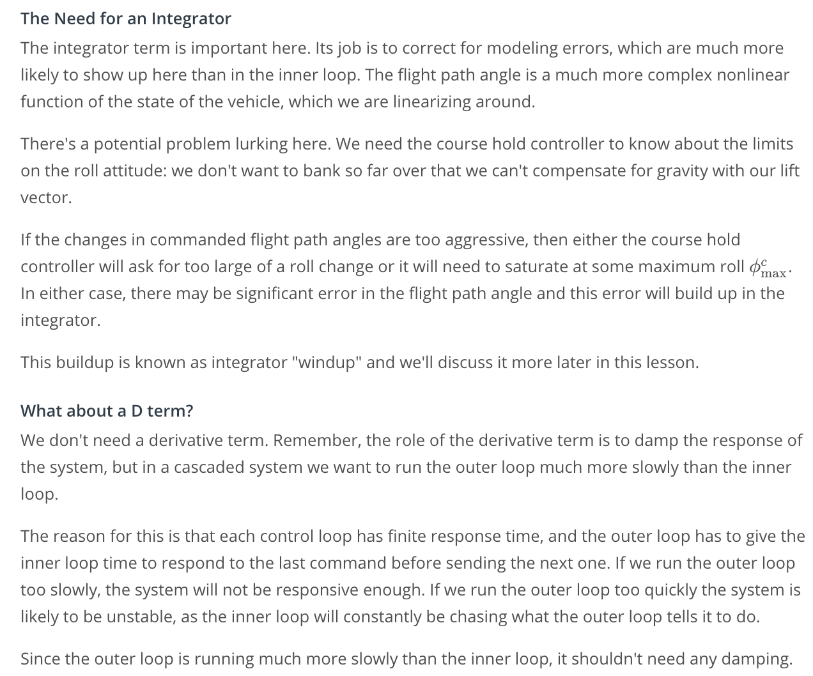

# Fixed-Wing Autopilot

## [1. Introduction](https://youtu.be/XI9c-HfW1WQ)

## [2. Fixed Wing Trajectories](https://youtu.be/tQkk_SCNzDQ)
## 3. System Architecture

## [4. Controller Design Principles](https://youtu.be/vWJxmSVaT1c)
## [5. Lateral Autopilot](https://youtu.be/xHw6zdfc2u0)
## 6. Course Hold

## 7. Inner Loops: Roll and Sideslip Hold

## [8. Longitudinal Autopilot](https://youtu.be/KRooEa015ms)
## 9. Longitudinal Control Loops

## 10. Autopilot Tuning

## 11. Integrator Windup Notebook

## [12. Conclusion](https://youtu.be/NoAimkRksso)