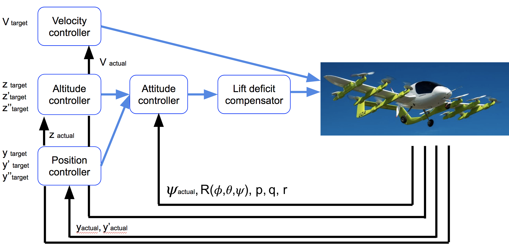

# 6. Optional Project: Fixed-Wing Control

## Fixed Wing Autopilot [Optional]

The Goal of this Project
In this project you'll implement a flight autopilot for a fixed wing aircraft. You'll be implementing this controller in Python (in the real world the flight controller will most likely be in a different programming language). The project will start with a manually controlled aircraft and by the end the aircraft will autonomously follow a prescribed path.

Project Instructions
All instructions can be found in the [project repository](https://github.com/udacity/FCND-FixedWing).

Note that this project is optional and will not be submitted. It's here for your learning and enjoyment. Have fun!

## Hybrid VTOL
In the flying car example, we will consider the VTOL-FW model similar to Cora developed by Kitty Hawk. The platform structure includes both multirotor and fixed-wing (FW) conventional aircraft control surfaces. The given model has twelve vertically facing propellers to generate the vertical lift and one horizontal propeller to generate the forward thrust.

The vehicle is designed to take off vertically similar to the rotary vehicle, transition into level flight, travel long distance as Fixed-wing airplane and transition back into vertical hover mode to land vertically. The given has an advantage of not requiring long runways and on the same be most effective on each mode of flight.

In the previous lesson, we showed you which aerodynamic forces are acting on the airplane and what conditions need to be satisfied for it to maintain level flight.

The aerodynamic forces are dependent on the forward velocity which is incorporated as aerodynamic dynamic pressure \bar{q} = \rho\frac{v^2}{2} 
q
¯
​	 =ρ 
2
v 
2
 
​	 .

We also covered quadrotor motion and its unique dynamics. We also outlined that quadrotor changes position by tilting the body in the direction in which it wants to go. While the VTOL-FW aircraft has 12 rotors, the fundamental dynamics are comparable to the quadrotor dynamics. Similar to how the quadrotor achieved the vertical thrust and moments along the axis to tilt and move inthe desired direction, the VTOL-FW achieves this by manipulating 12 rotors instead of 4.

As finding the propeller angular velocities in order to achieve the desired force and moments are trivial, we will not cover that. But instead we will concentrate on achieving the balance of the forces and moments during the transition. Both aerodynamic and rotor forces and moments need to work together to ensure vehicles properly transitions from one mode into another and back.

### The transitions
#### Taking off vertically and transitioning into the horizontal flight:
The vehicle takes off using the vertically directed propellers and acts similar to the quadrotor. It controls attitude and height solely using vertical propellers. After reaching the desired altitude the VTOL-FW starts to accelerate forward by using a horizontally facing propeller which generates forward thrust. During the transition, the VTOL rotors control the aircraft to wings-level, low drag configuration (approx. 0 pitch, 0 roll). As the vehicle gains forward momentum the aerodynamic forces start to act of it. As you remember the aerodynamic forces are proportional to the square of the velocity. This means that now vehicle generates partial lift from the wings as well. The aerodynamic lift force is counteracted by reducing the propeller generated force proportionally. Eventually, the vehicle achieves the desired forward speed that it can maintain the level flight just by aerodynamic lift. At this stage, vertical propellers are stopped and the vehicle is controlled using the control surfaces similar to the fixed wing airplane.

#### Transitioning from level flight to landing:
For landing, the transitioning aircraft starts with sufficient forward velocity such that it is controlled by aerodynamic forces. It stops the forward propeller thus generating no thrust forward and starts to decelerate due to aerodynamic drag. With a lower airspeed, the vehicle cannot generate sufficient lift to maintain the level flight. Thus it needs overcome the lift deficiency by using the vertical propellers. The vertical propellers dynamically increase the lift force as the aerodynamic lift diminishes resulting from the declining airspeed. During transition, the aileron and elevator are used to maintain a level aircraft. Finally, the vehicle is slowed down so much that aerodynamic forces are negligible and the vehicle is controlled using full VTOL mode.

The hybrid mode control architecture is shown below.

### Transition Airspeed
Airspeed is used to determine when transition is complete and the aircraft is controlled using fully fixed wing control or VTOL control. Transitioning from VTOL to fixed wing, an airspeed 70-80% cruise speed was chosen as the transition airspeed (30 m/s). Transitioning from fixed wing to VTOL, an airspeed was selected when the aerodynamic forces are negligible relative to the lift force produced by the vertical propellers (10 m/s). At this airspeed, the aerodynamic force produces ~10% of the needed lift and the aircraft control surfaces are very ineffective. Thus the vehicle is transitioned to full VTOL mode at that airspeed.

### Model Assumptions
In the control strategy, we assumed no aerodynamic coupling between the VTOL controls and the FW controls. In reality, the thrust generated by the VTOL rotors will have an effect on the lift of the aircraft wing and effectiveness of the control surfaces. Additionally the forward motion of the vehicle will have an effect the lift force generated by the vertical propellers. The simplistic transition control strategy proposed above relies very little on using both the VTOL and FW controls simultaneously (i.e. either the ailerons or the VTOL roll moment are used to control the aircraft roll, not both simultaneously). Without an accurate model of the aerodynamic coupling a tightly coupled approach using both VTOL and FW controls would be unrealistic. The VTOL-FW simulation also does not fully model this aerodynamic coupling and while a tightly coupled approach may be possible, may be more realistic.

